# 🔄 Flowchart Alur Bisnis AIS Sijah
**From Start to Finish**

---

## 📊 Flowchart Lengkap (Mermaid)

```mermaid
flowchart TD
    A["👤 PELANGGAN DATANG"] --> B["💻 ADMIN BUKA SISTEM"]
    B --> C{"Pelanggan Baru<br/>atau Lama?"}
    
    C -->|BARU| D["➕ INPUT DATA PELANGGAN<br/>Nama, NoWa, Alamat, Gender"]
    C -->|LAMA| E["🔍 CARI PELANGGAN<br/>di Database"]
    
    D --> F["📏 INPUT UKURAN BADAN<br/>Pilih Kategori & Measurements"]
    E --> F
    F --> G["✅ SIMPAN CUSTOMER<br/>& MEASUREMENT"]
    
    G --> H["📦 BUAT PESANAN<br/>(Create Order)"]
    H --> H1["1️⃣ INPUT DETAIL<br/>Judul, Tgl Masuk,<br/>Tgl Estimasi"]
    H1 --> H2["2️⃣ PILIH ITEMS<br/>Dari Measurement<br/>Input: Qty × Harga"]
    H2 --> H3["3️⃣ UPLOAD FOTO<br/>Referensi Pakaian<br/>(ke Cloud ☁️)"]
    H3 --> H4["4️⃣ TAMBAH BIAYA<br/>Bordir, Expedite, dll"]
    H4 --> H5["5️⃣ HITUNG TOTAL<br/>Subtotal + Biaya"]
    
    H5 --> I["🔐 SNAPSHOT DATA<br/>Salin: Nama, NoWa,<br/>Measurement ke Order"]
    I --> J["✅ SIMPAN ORDER<br/>Auto-generate Code<br/>ORD-001, ORD-002, dll"]
    
    J --> K["🎯 ORDER MASUK ANTRIAN<br/>Status: ANTREAN"]
    K --> L["✂️ POTONG KAIN<br/>Status: POTONG KAIN<br/>(1-2 hari)"]
    L --> M["🧵 DIJAHIT<br/>Status: DIJAHIT<br/>(3-5 hari) ← LONGEST"]
    M --> N["👔 FITTING<br/>Status: FITTING<br/>Try-on & Adjust (1-2 hari)"]
    N --> O["✨ SELESAI<br/>Status: SELESAI<br/>Ready untuk diambil"]
    
    O --> P{"Payment<br/>Status?"}
    P -->|BELUM BAYAR| Q1["💰 CUSTOMER BAYAR DP<br/>Admin catat pembayaran"]
    P -->|DP| Q1
    P -->|LUNAS| R["✅ SELESAI BAYAR"]
    
    Q1 --> Q2["💻 SISTEM HITUNG<br/>Total Bayar vs Total Harga"]
    Q2 --> Q3{"Total Bayar ≥<br/>Total Harga?"}
    Q3 -->|TIDAK| Q4["⚠️ STATUS: DP<br/>Sisa Tagihan ada"]
    Q3 -->|YA| Q5["✅ AUTO-LUNAS<br/>Status: LUNAS"]
    
    Q4 --> Q6["⏳ MENUNGGU<br/>Bayar Lunas"]
    Q6 --> Q7["💰 CUSTOMER BAYAR LUNAS<br/>Admin catat pembayaran"]
    Q7 --> Q2
    
    Q5 --> R
    R --> S["🚗 DIAMBIL CUSTOMER<br/>Status: DIAMBIL"]
    S --> T["✅ ✅ ORDER COMPLETE<br/>🎉 SELESAI TRANSAKSI"]
    
    style A fill:#FF6B6B
    style T fill:#51CF66
    style J fill:#FFD93D
    style K fill:#6BCB77
    style M fill:#FF6B6B
    style O fill:#4D96FF
    style Q5 fill:#51CF66
```



---

## 📋 Flowchart dalam Format Persegi & Panah (ASCII)

```
┌─────────────────────────────────────────────────────────────────┐
│                   ALUR BISNIS AIS SIJAH (LENGKAP)              │
└─────────────────────────────────────────────────────────────────┘

                            ┌──────────────┐
                            │ 👤 PELANGGAN │
                            │    DATANG    │
                            └──────┬───────┘
                                   │
                                   ↓
                            ┌──────────────────┐
                            │ 💻 ADMIN BUKA   │
                            │    SISTEM       │
                            └──────┬───────────┘
                                   │
                                   ↓
                            ┌─────────────────┐
                            │ Pelanggan Baru? │
                            └────┬────────┬───┘
                   ┌─────────────┘        └─────────────┐
                   │                                    │
                   ↓                                    ↓
          ┌─────────────────┐              ┌──────────────────┐
          │ ➕ INPUT DATA  │              │ 🔍 CARI DI DB  │
          │    PELANGGAN    │              │   (Pelanggan     │
          │ Nama, NoWa,     │              │    Lama)         │
          │ Alamat, Gender  │              └────────┬─────────┘
          └────────┬────────┘                       │
                   │                                │
                   └────────────────┬────────────────┘
                                    │
                                    ↓
                          ┌──────────────────┐
                          │ 📏 INPUT UKURAN  │
                          │      BADAN       │
                          └────────┬─────────┘
                                   │
                                   ↓
                          ┌──────────────────┐
                          │ ✅ SIMPAN        │
                          │ CUSTOMER &       │
                          │ MEASUREMENT      │
                          └────────┬─────────┘
                                   │
                                   ↓
╔═════════════════════════════════════════════════════════════════╗
║                   📦 BUAT PESANAN (ORDER)                       ║
╠═════════════════════════════════════════════════════════════════╣
║                                                                 ║
║  ┌─────────────────────────────────────────────────────┐      ║
║  │ 1️⃣ INPUT DETAIL PESANAN                             │      ║
║  │    - Judul Pesanan                                  │      ║
║  │    - Tanggal Masuk (today)                          │      ║
║  │    - Tanggal Estimasi Selesai                       │      ║
║  │    - Jenis Pakaian (Kebaya, Jas, dll)              │      ║
║  │    - Catatan Khusus                                 │      ║
║  └─────────────────────────────────────────────────────┘      ║
║                            ↓                                   ║
║  ┌─────────────────────────────────────────────────────┐      ║
║  │ 2️⃣ PILIH ITEMS (dari measurement history)           │      ║
║  │    - Pilih measurement (Ukuran Formal, Santai, dll)│      ║
║  │    - Input Quantity                                 │      ║
║  │    - Input Harga Satuan                             │      ║
║  │    → Auto-calc Subtotal                             │      ║
║  └─────────────────────────────────────────────────────┘      ║
║                            ↓                                   ║
║  ┌─────────────────────────────────────────────────────┐      ║
║  │ 3️⃣ UPLOAD FOTO REFERENSI                            │      ║
║  │    - Upload dari Customer (Pinterest/Instagram)     │      ║
║  │    - Validasi: JPG/PNG/WebP < 5MB                  │      ║
║  │    - Upload to Vercel Blob Cloud ☁️                │      ║
║  │    → Simpan URL ke Database                         │      ║
║  └─────────────────────────────────────────────────────┘      ║
║                            ↓                                   ║
║  ┌─────────────────────────────────────────────────────┐      ║
║  │ 4️⃣ TAMBAH BIAYA TAMBAHAN                            │      ║
║  │    - Bordir Emas                                    │      ║
║  │    - Expedite/Kilat                                 │      ║
║  │    - Premium Kain                                   │      ║
║  │    - Dsb                                            │      ║
║  └─────────────────────────────────────────────────────┘      ║
║                            ↓                                   ║
║  ┌─────────────────────────────────────────────────────┐      ║
║  │ 5️⃣ HITUNG TOTAL HARGA                               │      ║
║  │    Subtotal + Biaya Tambahan = TOTAL HARGA         │      ║
║  └─────────────────────────────────────────────────────┘      ║
║                                                                 ║
╚═════════════════════════════════════════════════════════════════╝
                                   │
                                   ↓
                          ┌──────────────────┐
                          │ 🔐 SNAPSHOT DATA │
                          │ Salin: Nama,     │
                          │ NoWa, Measurement│
                          │ ke dalam Order   │
                          └────────┬─────────┘
                                   │
                                   ↓
                          ┌──────────────────┐
                          │ ✅ SIMPAN ORDER  │
                          │ Auto-generate    │
                          │ Code: ORD-001    │
                          │ Status: ANTREAN  │
                          │ Bayar: BELUM BAYAR
                          └────────┬─────────┘
                                   │
╔═════════════════════════════════════════════════════════════════╗
║              🏭 PRODUCTION PIPELINE (6 STAGES)                  ║
╠═════════════════════════════════════════════════════════════════╣
║                                                                 ║
║  STAGE 1         STAGE 2         STAGE 3      STAGE 4          ║
║  ┌───────┐      ┌───────┐      ┌───────┐    ┌───────┐         ║
║  │🔴    │      │🟠    │      │🟡    │    │🟢    │         ║
║  │ANTREAN├─────→│POTONG ├─────→│DIJAHIT├───→│FITTING│         ║
║  │       │      │KAIN   │      │       │    │       │         ║
║  │ 0 hari│      │1-2hr  │      │3-5hr  │    │1-2hr  │         ║
║  └───────┘      └───────┘      └───────┘    └───┬───┘         ║
║                                                   │             ║
║                                   STAGE 5        ↓             ║
║                                   ┌───────┐      ┌───────┐     ║
║                                   │🔵    │      │✨    │     ║
║                                   │SELESAI├─────→│DIAMBIL│     ║
║                                   │       │      │       │     ║
║                                   │0 hari │      │sama hr│     ║
║                                   └───────┘      └───────┘     ║
║                                                                 ║
║  TOTAL WAKTU PRODUKSI: ~9 hari (dari Antrean hingga Selesai)  ║
║                                                                 ║
╚═════════════════════════════════════════════════════════════════╝
                                   │
                                   ↓
╔═════════════════════════════════════════════════════════════════╗
║               💰 PAYMENT & AUTO-LUNAS LOGIC                     ║
╠═════════════════════════════════════════════════════════════════╣
║                                                                 ║
║              ┌──────────────────────────────────┐              ║
║              │ Status Bayar: BELUM BAYAR        │              ║
║              │ Total: Rp1,050,000               │              ║
║              │ Dibayar: Rp0                     │              ║
║              └──────────┬───────────────────────┘              ║
║                         │                                      ║
║                         ↓                                      ║
║        ┌────────────────────────────────┐                     ║
║        │ 💰 CUSTOMER BAYAR DP           │                     ║
║        │ Input: Rp500,000 (50%)          │                     ║
║        │ Admin catat di system            │                     ║
║        └────────────┬─────────────────────┘                     ║
║                     │                                          ║
║                     ↓                                          ║
║        ┌────────────────────────────────┐                     ║
║        │ 💻 SISTEM HITUNG               │                     ║
║        │ Total Bayar = Rp500,000         │                     ║
║        │ vs Total Harga = Rp1,050,000    │                     ║
║        │ Rp500k >= Rp1.05M? TIDAK ❌    │                     ║
║        └────────────┬─────────────────────┘                     ║
║                     │                                          ║
║                     ↓                                          ║
║        ┌────────────────────────────────┐                     ║
║        │ ⚠️ STATUS TETAP: DP             │                     ║
║        │ Sisa Bayar: Rp550,000 🔴        │                     ║
║        │ Customer inget bayar lagi       │                     ║
║        └────────────┬─────────────────────┘                     ║
║                     │                                          ║
║                     ↓ (Customer bayar lunas)                   ║
║        ┌────────────────────────────────┐                     ║
║        │ 💰 CUSTOMER BAYAR LUNAS         │                     ║
║        │ Input: Rp550,000                │                     ║
║        │ Admin catat di system            │                     ║
║        └────────────┬─────────────────────┘                     ║
║                     │                                          ║
║                     ↓                                          ║
║        ┌────────────────────────────────┐                     ║
║        │ 💻 SISTEM HITUNG (LAGI)        │                     ║
║        │ Total Bayar = Rp1,050,000      │                     ║
║        │ vs Total Harga = Rp1,050,000    │                     ║
║        │ Rp1.05M >= Rp1.05M? YA ✅      │                     ║
║        └────────────┬─────────────────────┘                     ║
║                     │                                          ║
║                     ↓                                          ║
║        ┌────────────────────────────────┐                     ║
║        │ ✅ STATUS AUTO-CHANGE: LUNAS    │                     ║
║        │ Sisa Bayar: Rp0                 │                     ║
║        │ Transaksi Payment SELESAI       │                     ║
║        └────────────┬─────────────────────┘                     ║
║                                                                 ║
╚═════════════════════════════════════════════════════════════════╝
                                   │
                                   ↓
                        ┌──────────────────────┐
                        │ 🚗 CUSTOMER AMBIL    │
                        │    PESANAN           │
                        │ Status: DIAMBIL      │
                        └──────────┬───────────┘
                                   │
                                   ↓
                        ┌──────────────────────┐
                        │ ✅ ✅ ORDER COMPLETE │
                        │ 🎉 SELESAI TRANSAKSI│
                        │                      │
                        │ Semua selesai:       │
                        │ ✓ Produksi selesai  │
                        │ ✓ Bayar lunas       │
                        │ ✓ Customer puas     │
                        └──────────────────────┘
```

---

## 🔗 Penjelasan Singkat Per Stage:

| Stage | Aktivitas | Duration | Status |
|-------|-----------|----------|--------|
| **1. ANTREAN** | Order diterima, masuk antrian | 1 hari | 🔴 |
| **2. POTONG KAIN** | Kain dipotong sesuai ukuran | 1-2 hari | 🟠 |
| **3. DIJAHIT** | Proses jahit utama (longest) | 3-5 hari | 🟡 |
| **4. FITTING** | Pas badan & adjustment | 1-2 hari | 🟢 |
| **5. SELESAI** | QC final, siap diambil | same day | 🔵 |
| **6. DIAMBIL** | Customer ambil pesanan | - | ✅ |

---

**Total waktu produksi: ~9 hari (dari Antrean sampai Selesai)**

