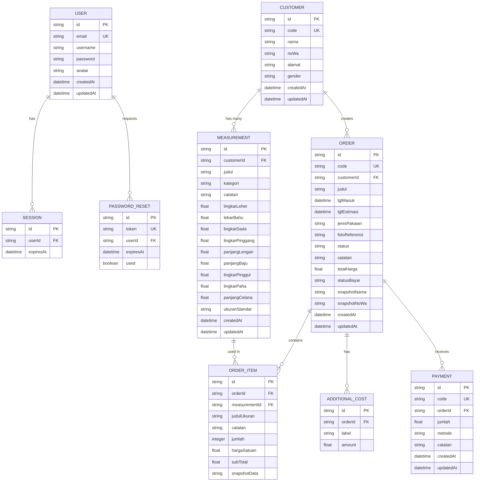
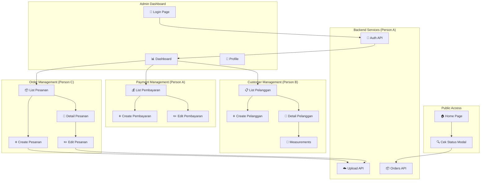
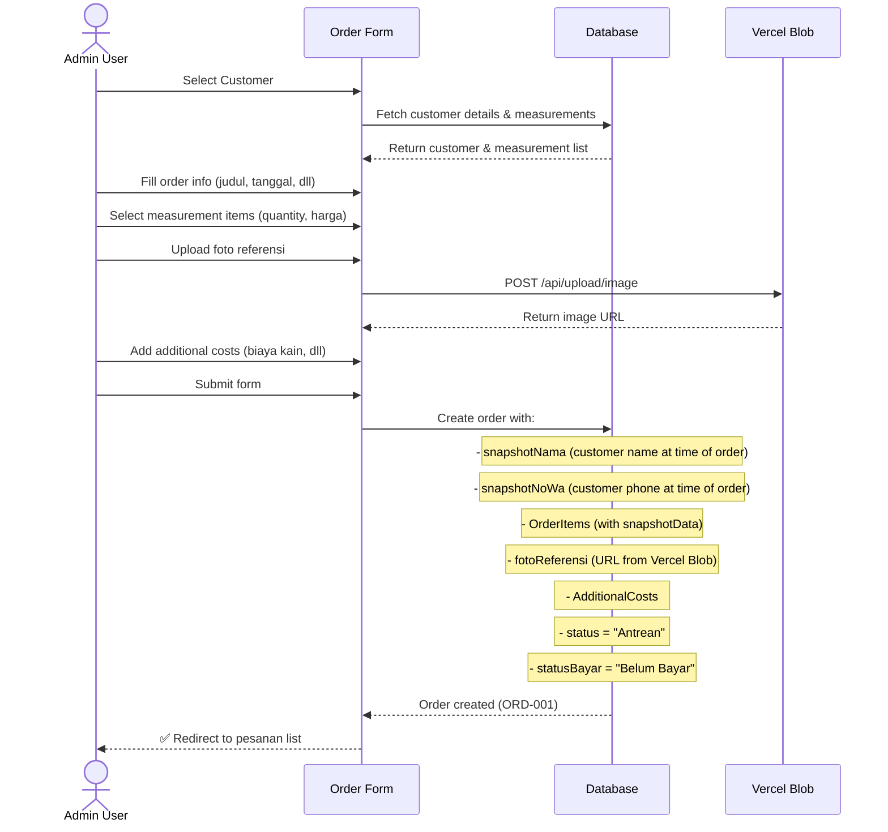
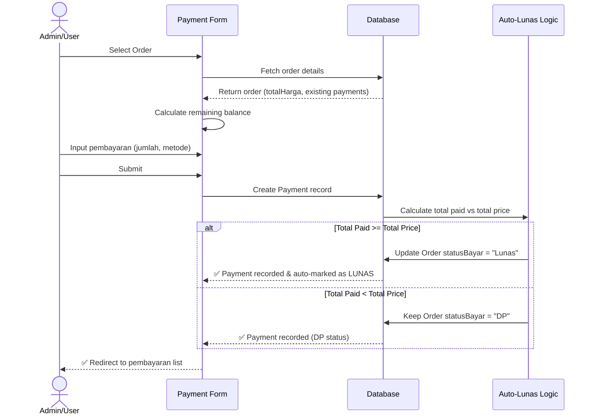
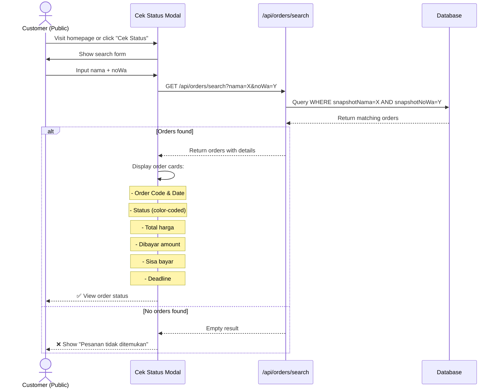
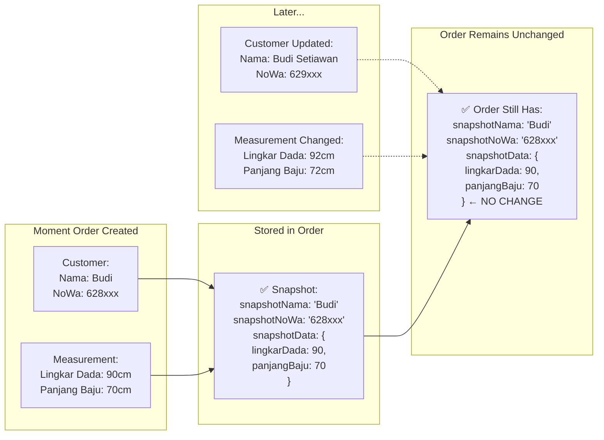

# 📊 Progress Report — AIS Sijah
**Status**: MVP 95% Completed | **Last Updated**: 2026-05-20

---

## 📋 Ringkasan Fitur & Pembagian Pekerjaan

| Fitur | Status | Pengerjaan | Progress |
|-------|--------|-----------|----------|
| **Authentication & User Management** | ✅ Done | Person A | 100% |
| **Manajemen Pelanggan (Customer)** | ✅ Done | Person B | 100% |
| **Manajemen Ukuran Badan** | ✅ Done | Person B | 100% |
| **Manajemen Pesanan (Order)** | ✅ Done | Person C | 100% |
| **Tracking Status Produksi** | ✅ Done | Person C | 100% |
| **Manajemen Pembayaran (Payment)** | ✅ Done | Person A | 100% |
| **Cek Status Publik** | ✅ Done | Person C | 100% |
| **Upload Gambar ke Cloud** | ✅ Done | Person A | 100% |
| **Dashboard (Optional)** | ⏳ In Progress | — | 0% |

---

## 👤 Person A — Authentication, Payment & Cloud Storage
**Fokus**: Backend security, payment logic, file handling

### ✅ Selesai
- [x] Login/Logout system dengan session
- [x] Password hashing menggunakan bcryptjs
- [x] Forgot Password & Reset Password flow
- [x] Session management (expires after 30 days)
- [x] Password reset token validation
- [x] Update Password functionality
- [x] **Payment recording** dengan auto-lunas logic
  - DP (Down Payment) tracking
  - Payment history per order
  - Auto status → Lunas when paid >= total
- [x] **Vercel Blob Storage integration**
  - Upload image endpoint (`/api/upload/image`)
  - Async image upload
  - Cloud storage instead of database
  - 5MB file size support

### 📁 Files yang Dikerjakan
```
src/lib/auth.ts                 — Session & user validation
src/lib/actions/auth.ts         — Login, logout, password reset
src/components/ProfileForm.tsx  — User profile management
src/components/ResetPasswordForm.tsx
src/app/api/auth/               — Auth endpoints
src/components/PembayaranRowActions.tsx
src/components/PembayaranEditForm.tsx
src/app/pembayaran/             — Payment pages
src/app/api/upload/image/route.ts  — Image upload API ⭐ NEW
```

### 🔍 Dokumentasi Fitur
**Payment Auto-Lunas Logic**:
- Saat pembayaran tercatat → sistem cek total bayar
- Jika total bayar >= total harga → status_pembayaran = "Lunas"
- Payment history tersimpan per pesanan

**Image Upload (Vercel Blob)**:
- File diupload ke cloud bukan database
- Return public URL yang disimpan di DB
- Images persist di Vercel production

---

## 👤 Person B — Customer Management & Measurements
**Fokus**: Data management, customer lifecycle, body measurements

### ✅ Selesai
- [x] **CRUD Pelanggan (Customers)**
  - Create customer baru
  - List semua customers dengan pagination
  - View customer detail
  - Edit customer info (nama, WhatsApp, alamat, gender)
  - Delete customer
  - Auto-generated customer code (e.g., CUST-001)

- [x] **Multi-version Body Measurements**
  - 1 customer → many measurements
  - 3 kategori: Atasan / Bawahan / Standar
  - Atasan fields: lingkar leher, bahu, dada, pinggang, lengan, panjang baju
  - Bawahan fields: lingkar pinggang, pinggul, paha, panjang celana
  - Measurement labels untuk identifikasi (e.g., "Ukuran Formal 2025")
  - Custom notes per measurement
  - Timestamp created/updated

- [x] **Measurement History View**
  - List semua ukuran per customer
  - Edit/delete measurements
  - Display dengan kategori grouping

### 📁 Files yang Dikerjakan
```
src/app/pelanggan/              — Customer pages
src/app/pelanggan/new/          — Create customer
src/app/pelanggan/[id]/         — Customer detail & edit
src/components/PelangganForm.tsx — Customer form component
src/lib/actions/pelanggan.ts    — Customer actions
prisma/schema.prisma            — Customer & Measurement models
```

### 🔍 Dokumentasi Fitur
**Customer Data Structure**:
- `code`: Unique customer identifier (CUST-001)
- `nama`: Full name
- `noWa`: WhatsApp number (format: 628xxx)
- `alamat`: Full address
- `gender`: Laki-laki / Perempuan

**Measurement Snapshotting**:
- Saat order dibuat → measurement data di-snapshot ke order
- Perubahan measurement di kemudian hari tidak mempengaruhi order lama
- Preserves historical accuracy

---

## 👤 Person C — Order & Status Tracking
**Fokus**: Order lifecycle, production workflow, public features

### ✅ Selesai
- [x] **CRUD Pesanan (Orders)**
  - Create order baru dengan multi-items
  - List orders dengan filter & sort
  - View order detail dengan full breakdown
  - Edit order information
  - Delete order
  - Auto-generated order code (e.g., ORD-001)

- [x] **Order Status Workflow**
  - 6 status: Antrean → Potong Kain → Dijahit → Fitting → Selesai → Diambil
  - Plus: Dibatalkan (optional)
  - Real-time status update di detail page
  - Status-based filtering in order list

- [x] **Order Items Management**
  - Multi-item per order (1 order = many items dari measurements)
  - Per-item: quantity × unit price = sub-total
  - Snapshot measurement data (terbuat dari body measurements)
  - Item-level notes

- [x] **Additional Costs**
  - Per-order biaya tambahan (kain, aksesoris, expedite, dll)
  - Dynamic cost labels
  - Add/remove costs on the fly

- [x] **Public Status Check (Cek Status)**
  - Customers cek status di halaman home tanpa login
  - Query by nama + nomor WhatsApp (snapshot fields)
  - Display: order code, status produksi, status pembayaran
  - Show: total harga, sudah dibayar, sisa bayar
  - Deadline visibility

- [x] **Image Reference Upload**
  - Upload foto referensi pakaian per order
  - Integrasi dengan Vercel Blob Storage (via Person A)
  - Display di order detail page

### 📁 Files yang Dikerjakan
```
src/app/pesanan/                — Order pages
src/app/pesanan/new/            — Create order
src/app/pesanan/[code]/         — Order detail & edit
src/app/cek-status/             — Public status check page
src/components/PesananForm.tsx  — Create order form
src/components/PesananEditForm.tsx — Edit order form
src/components/CekStatusModal.tsx  — Public status modal
src/components/StatusDropdown.tsx  — Status selector
src/lib/actions/pesanan.ts      — Order actions
src/app/api/orders/search       — Search API untuk cek status
```

### 🔍 Dokumentasi Fitur
**Order Snapshotting**:
```
Saat pesanan dibuat:
- Salin nama & noWa dari customer → snapshotNama, snapshotNoWa
- Salin seluruh measurement data → snapshotData (JSON)
- Perubahan customer data kemudian tidak mempengaruhi pesanan lama
```

**Status Workflow**:
```
Antrean (customer baru masuk)
  ↓
Potong Kain (cutting phase)
  ↓
Dijahit (sewing phase)
  ↓
Fitting (try-on & adjustment)
  ↓
Selesai (production done)
  ↓
Diambil (picked up by customer)
```

**Cek Status Feature**:
- Pelanggan input: Nama + No. WhatsApp (dari saat order)
- API query ke `snapshotNama` & `snapshotNoWa`
- Display order(s) ditemukan dengan detail lengkap
- Real-time payment status update

---

## 🎯 MVP Features — Status Summary

| # | Fitur | Done | Person | Evidence |
|---|-------|------|--------|----------|
| 1 | Auth (login/logout/password reset) | ✅ | A | `/login`, `/api/auth/*` |
| 2 | CRUD Pelanggan | ✅ | B | `/pelanggan` pages |
| 3 | CRUD Ukuran Badan (multi per pelanggan) | ✅ | B | Measurement model, detail pages |
| 4 | CRUD Pesanan + snapshot | ✅ | C | `/pesanan` pages, snapshot fields |
| 5 | Status tracking produksi | ✅ | C | StatusDropdown, status enum |
| 6 | Pencatatan pembayaran + auto-lunas | ✅ | A | `/pembayaran` pages, payment logic |
| 7 | Cek status publik (nama + noWa) | ✅ | C | `/cek-status`, `/api/orders/search` |
| 8 | Upload foto referensi (cloud) | ✅ | A | Vercel Blob integration |

---

## 🗄️ Database Architecture (ERD)



---

## 🔄 System Flow Architecture



---

## 📝 Order Creation Flow (Person C)



---

## 💰 Payment Flow (Person A)



---

## 🎯 Status Tracking Flow (Person C)

```mermaid
stateDiagram-v2
    [*] --> Antrean: Order created
    Antrean --> "Potong Kain": Admin update
    "Potong Kain" --> Dijahit: Admin update
    Dijahit --> Fitting: Admin update
    Fitting --> Selesai: Admin update
    Selesai --> Diambil: Customer pickup
    Diambil --> [*]: Order completed
    
    Antrean -.-> Dibatalkan: Cancel
    "Potong Kain" -.-> Dibatalkan: Cancel
    Dibatalkan --> [*]: Order cancelled
```

---

## 🔍 Public Status Check Flow (Person C)



---

## 📊 Data Snapshotting Illustration



---

## 🏢 Business Process Explanation

### **Proses 1: Manajemen Pelanggan (Person B)**

#### 📌 Alur Bisnis
```
1. CUSTOMER MASUK (Baru/Lama)
   ↓
2. INPUT DATA PELANGGAN
   - Nama lengkap
   - Nomor WhatsApp (untuk komunikasi & pencarian status)
   - Alamat (untuk pengiriman/pickup)
   - Gender (untuk rekomendasi ukuran)
   ↓
3. SIMPAN KE DATABASE
   - Sistem auto-generate customer code (CUST-001, CUST-002, dll)
   ↓
4. INPUT UKURAN BADAN
   - Bisa multiple versions (Ukuran Formal, Ukuran Santai, dll)
   - Pilih kategori: Atasan / Bawahan / Standar
   - Input measurement fields sesuai kategori
   - Tambah catatan khusus (mis: "Minta pinggang longgar")
   ↓
5. SIMPAN MEASUREMENT
   - Linked ke customer
   - Timestamped (created_at, updated_at)
   ↓
6. GUNAKAN UNTUK PESANAN
   - Saat buat order, pilih dari measurement history
   - Data di-snapshot ke order (jadi history pesanan tetap akurat)
```

#### 💼 Nilai Bisnis
- **Accuracy**: Data ukuran tersimpan rapi, tidak tercecer
- **Efficiency**: Pelanggan lama tidak perlu input ukuran lagi
- **Traceability**: Punya riwayat ukuran pelanggan dari waktu ke waktu
- **Flexibility**: 1 customer bisa punya banyak versi ukuran

#### 👥 Contoh Real-Life
```
Customer: Ibu Siti
- CUST-001
- Nama: Siti Nurhaliza
- No WA: 628123456789
- Alamat: Jl. Merdeka 123

Measurements:
├─ Ukuran Formal 2025
│  ├─ Kategori: Atasan
│  ├─ Lingkar Dada: 88cm
│  ├─ Panjang Baju: 65cm
│  └─ Catatan: "Formal untuk acara"
│
└─ Ukuran Santai 2025
   ├─ Kategori: Atasan
   ├─ Lingkar Dada: 92cm
   ├─ Panjang Baju: 70cm
   └─ Catatan: "Untuk sehari-hari"
```

---

### **Proses 2: Pencatatan Pesanan (Person C)**

#### 📌 Alur Bisnis
```
1. CUSTOMER MEMESAN
   - Admin atau customer datang dengan permintaan
   ↓
2. CARI/BUAT CUSTOMER DATA
   - Jika pelanggan baru → input data pelanggan dulu
   - Jika lama → cari di database
   ↓
3. INPUT DETAIL PESANAN
   - Judul pesanan (mis: "Kebaya untuk nikahan")
   - Tanggal masuk (hari pesanan diterima)
   - Tanggal estimasi selesai (deadline pengerjaan)
   - Jenis pakaian (Kebaya, Jas, Celana, dll)
   - Catatan khusus (mis: "Ada bordir emas")
   ↓
4. PILIH UKURAN & ITEM
   - Pilih dari measurement history pelanggan
   - Input: jumlah × harga satuan = sub-total
   - Bisa multi-item (mis: 2 item Kebaya @ Rp500k + 1 Sarung @ Rp150k)
   ↓
5. UPLOAD FOTO REFERENSI
   - Foto model pakaian dari Pinterest/Instagram/dll
   - Disimpan di Vercel Blob Cloud (bukan database)
   ↓
6. TAMBAH BIAYA TAMBAHAN
   - Biaya kain premium
   - Biaya bordir/jahit khusus
   - Biaya expedite/kilat
   - Dsb
   ↓
7. HITUNG TOTAL
   - Subtotal (jumlah × harga) untuk semua items
   - + Biaya tambahan
   = Total Harga
   ↓
8. SIMPAN ORDER
   - Status awal: "Antrean"
   - Bayar status: "Belum Bayar"
   - PENTING: Snapshot data pelanggan & ukuran ke order
     (supaya kalau customer ubah data, order tetap pake data lama)
   ↓
9. GENERATE ORDER CODE
   - Sistem auto-generate: ORD-001, ORD-002, dll
   - Disimpan sebagai unique identifier
```

#### 💼 Nilai Bisnis
- **Traceability**: Setiap pesanan punya unique ID & historical data
- **Flexibility**: Bisa track multiple items dalam 1 order
- **Accuracy**: Snapshot jamin history tidak berubah
- **Documentation**: Foto referensi jadi bukti kesepakatan
- **Cost Control**: Detail biaya transparent untuk customer

#### 👥 Contoh Real-Life
```
Order: ORD-001 (terbuat 2026-05-20)
├─ Customer: Ibu Siti (CUST-001)
├─ Snapshot saat order dibuat:
│  ├─ Nama: Siti Nurhaliza
│  ├─ No WA: 628123456789
│  └─ Measurement snapshot dari Ukuran Formal 2025
│
├─ Detail Pesanan:
│  ├─ Judul: "Kebaya Pengikut Pengantin"
│  ├─ Tgl Masuk: 2026-05-20
│  ├─ Tgl Estimasi: 2026-06-10
│  ├─ Jenis: Kebaya
│  ├─ Catatan: "Ada bordir emas, permak di bagian pinggang"
│
├─ Items:
│  ├─ Item 1: Ukuran Formal 2025 × 1 @ Rp500,000 = Rp500,000
│  └─ Item 2: Sarung @ Rp100,000 = Rp100,000
│  Subtotal: Rp600,000
│
├─ Biaya Tambahan:
│  ├─ Bordir Emas Gelung: Rp300,000
│  └─ Expedite (selesai 1 minggu): Rp150,000
│
├─ Total Harga: Rp1,050,000
├─ Status: Antrean
├─ Status Bayar: Belum Bayar
└─ Foto Referensi: [Kebaya dari Pinterest] (cloud URL)
```

---

### **Proses 3: Tracking Status Produksi (Person C)**

#### 📌 Alur Bisnis
```
1. ORDER MASUK KE ANTRIAN
   Status: "Antrean" ← Pesanan terdaftar, menunggu giliran produksi
   ↓
2. MULAI POTONG KAIN
   Status: "Potong Kain" ← Kain sedang dipotong sesuai pola
   - QC kain, marking pola, cutting
   ↓
3. PROSES JAHIT
   Status: "Dijahit" ← Kain sedang dijahit
   - Main sewing, detail sewing, attachment
   ↓
4. FITTING/PAS BADAN
   Status: "Fitting" ← Pakaian dicoba & disesuaikan
   - Pas badan, adjustment, final details
   - Bisa ada revisi kalau perlu
   ↓
5. PRODUKSI SELESAI
   Status: "Selesai" ← Pakaian jadi & QC final
   - Ready untuk pengambilan
   - Waiting for customer to pick up
   ↓
6. DIAMBIL CUSTOMER
   Status: "Diambil" ← Order complete
   - Customer telah mengambil pesanannya
   - Transaction finished
```

#### 💼 Nilai Bisnis
- **Visibility**: Customer bisa lihat progress pesanannya real-time
- **Accountability**: Admin track setiap tahap produksi
- **Deadline Management**: Lihat kapan harus selesai
- **Customer Satisfaction**: Transparency meningkatkan kepercayaan
- **Workflow Optimization**: Tahu bottleneck mana

#### 🎨 Status Visual
```
Antrean        📍 Order baru, waiting queue
   ↓
Potong Kain    📍 Fabric cutting in progress
   ↓
Dijahit        📍 Sewing in progress (longest phase)
   ↓
Fitting        📍 Tailoring adjustments
   ↓
Selesai        📍 Ready for pickup
   ↓
Diambil        ✅ Order completed
```

---

### **Proses 4: Pencatatan Pembayaran & Auto-Lunas (Person A)**

#### 📌 Alur Bisnis
```
1. CUSTOMER MAU BAYAR
   ↓
2. ADMIN BUKA HALAMAN PEMBAYARAN
   - Pilih order yang ingin dicatat pembayarannya
   - Sistem tampilkan:
     * Total harga yang harus dibayar
     * Riwayat pembayaran sebelumnya (jika ada)
     * Sisa yang belum dibayar
   ↓
3. INPUT PEMBAYARAN
   - Nominal yang dibayarkan (bisa DP/sebagian atau lunas)
   - Metode: Tunai atau Transfer
   - Catatan (mis: "Via BCA Transfer")
   ↓
4. SIMPAN PEMBAYARAN
   - Sistem auto-generate payment code: PMT-001, PMT-002, dll
   - Timestamp: kapan pembayaran dicatat
   ↓
5. SISTEM CEK AUTO-LUNAS ⭐ SMART LOGIC
   - Hitung: Total pembayaran (sum semua payment records)
   
   IF Total Bayar >= Total Harga THEN
      ✅ Status Pembayaran = "Lunas"
   ELSE
      ⚠️ Status Pembayaran = "DP"
   END
   
   ↓
6. UPDATE ORDER STATUS
   - Jika lunas → customer tidak perlu bayar lagi
   - Jika DP → sisa tagihan masih ada (customer ingat bayar)
   ↓
7. DISPLAY RIWAYAT
   - Admin bisa lihat semua pembayaran per order
   - Tracking siapa bayar, kapan, berapa, metode apa
```

#### 💼 Nilai Bisnis
- **Automation**: Tidak perlu manual hitung sisa bayar
- **Accuracy**: Sistem auto-check, tidak ada human error
- **Transparency**: Customer & admin jelas sisa/lunas
- **Audit Trail**: Riwayat pembayaran tersimpan lengkap
- **Flexibility**: Bisa terima pembayaran bertahap (DP → Lunas)

#### 👥 Contoh Real-Life
```
Order: ORD-001 (Total: Rp1,050,000)

Payment 1 (PMT-001):
├─ Tanggal: 2026-05-21
├─ Nominal: Rp500,000 (DP 50%)
├─ Metode: Tunai
└─ Status: DP (Lunas: Rp500,000 / Rp1,050,000)

Payment 2 (PMT-002):
├─ Tanggal: 2026-06-05
├─ Nominal: Rp550,000 (Lunasan)
├─ Metode: Transfer BCA
└─ Status: ✅ LUNAS (Total: Rp1,050,000 / Rp1,050,000)

---

Timeline:
21 Mei  → Bayar Rp500k (DP) → Sisa: Rp550,000 → Status: DP
05 Juni → Bayar Rp550k → Total = Rp1,050k → Status: ✅ LUNAS
```

#### 🔔 Important Logic
```
Auto-Lunas Calculation:

Total Harga: Rp1,000,000

Case 1: Pembayaran Rp600,000
  → Status: "DP" (Belum lunas)
  → Sisa: Rp400,000
  → Customer inget harus bayar Rp400,000 lagi

Case 2: Pembayaran Rp1,000,000
  → Status: "Lunas" (Selesai bayar)
  → Sisa: Rp0
  → Selesai transaksi

Case 3: Pembayaran Rp1,200,000 (overpay)
  → Status: "Lunas" (Tetap lunas, gak perlu bayar lagi)
  → Sisa: Rp0 (tidak bisa negative)
  → Kembalian: Rp200,000 (catat di catatan)
```

---

### **Proses 5: Cek Status Publik (Person C)**

#### 📌 Alur Bisnis (Customer Perspective)
```
1. CUSTOMER INGIN CARI PESANAN
   - Buka halaman home sijah.asy-syifa.com
   - Lihat tombol "Cek Status Jahitan"
   ↓
2. KLIK TOMBOL CEK STATUS
   - Modal/form terbuka
   - Input 2 field: Nama + No. WhatsApp
   (Data ini yang customer input saat pertama kali order)
   ↓
3. SUBMIT PENCARIAN
   - Sistem cari di database
   - Query: WHERE snapshotNama = ? AND snapshotNoWa = ?
   (Pake snapshot, bukan customer data yang bisa berubah)
   ↓
4. LIHAT HASIL PENCARIAN
   - Jika ada order ditemukan:
     * Kode pesanan (ORD-001)
     * Status produksi (warna-coded: merah=antrean, dll)
     * Status pembayaran (Belum Bayar / DP / Lunas)
     * Total harga pesanan
     * Berapa yang sudah dibayar
     * Sisa yang harus dibayar (jika ada)
     * Deadline pengerjaan
   
   - Jika tidak ada order:
     * "Pesanan tidak ditemukan"
     * Saran: Cek nama dan nomor WA
   ↓
5. LIHAT DETAIL
   - Customer bisa lihat berapa lama lagi
   - Tahu status produksi sekarang
   - Tahu berapa sisa yang harus dibayar
   ↓
6. HUBUNGI ADMIN (jika perlu)
   - Whatsapp ke admin untuk pertanyaan lanjutan
```

#### 💼 Nilai Bisnis
- **Self-Service**: Customer bisa cek sendiri, kurangi chat/telepon ke admin
- **24/7 Access**: Cek status kapan saja, tidak perlu hubungi toko
- **Transparency**: Jelas dimana pesanan & berapa hutang
- **Customer Satisfaction**: Rasa diperhatikan, bukan "gelap"
- **Reduce Admin Work**: Admin tidak perlu reply "pesanan mu di mana"

#### 👥 Contoh Real-Life
```
Customer: Ibu Siti mau cek pesanan

Input:
- Nama: Siti Nurhaliza
- No WA: 628123456789

Output (found!):
┌─────────────────────────────────────┐
│ PESANAN: ORD-001                    │
│ Status: 🟡 DIJAHIT (yellow)         │
│ Bayar:  🟠 DP (orange)              │
├─────────────────────────────────────┤
│ Pesanan: Kebaya Pengantin           │
│ Total: Rp1,050,000                  │
│ Bayar: Rp500,000 (DP)               │
│ Sisa: Rp550,000                     │
│ Deadline: 10 Juni 2026              │
│                                     │
│ [📄 Download Invoice]               │
└─────────────────────────────────────┘

Ibu Siti jadi tahu:
- Pesanannya sedang dijahit ✅
- Harus bayar sisa Rp550k ✅
- Harus selesai sebelum 10 Juni ✅
- Tidak perlu telpon admin lagi ✅
```

---

### **Proses 6: Upload Foto Referensi (Person A)**

#### 📌 Alur Bisnis
```
1. ADMIN UPLOAD FOTO SAAT BUAT ORDER
   - Customer bawa foto referensi (dari Pinterest/Instagram)
   - Admin upload via form "Referensi Gambar"
   ↓
2. VALIDASI FILE
   - Sistem cek: Format JPG/PNG/WebP? ✅
   - Sistem cek: Ukuran < 5MB? ✅
   - Jika tidak lolos → error, minta re-upload
   ↓
3. UPLOAD KE CLOUD (Vercel Blob)
   - File tidak disimpan di database (terlalu berat)
   - File dikirim ke Vercel Blob Storage (cloud server)
   - Sistem return: Public URL (https://...)
   ↓
4. SIMPAN URL KE DATABASE
   - Database hanya simpan: "https://blob.vercel-storage.com/..."
   - Bukan simpan seluruh file (efficient!)
   ↓
5. DISPLAY DI ORDER DETAIL
   - Admin bisa lihat foto referensi di halaman detail pesanan
   - Jahit jadi tahu harus model gimana
   ↓
6. PUBLIC CEK STATUS
   - Customer juga bisa lihat foto referensi
   - Di modal "Cek Status" → ada preview foto pesanannya
```

#### 💼 Nilai Bisnis
- **Clarity**: Jahit tahu persis model yang diminta customer
- **Reduce Miscommunication**: Foto lebih jelas dari deskripsi
- **Cloud Storage**: Image tersimpan permanent di cloud (tidak hilang)
- **Efficiency**: Database tidak jadi berat/bloat
- **Production Quality**: Jahit bisa refer foto kapan aja saat produksi

#### 🖼️ Contoh Real-Life
```
Order: ORD-001 "Kebaya Pengantin"

Foto Referensi:
├─ Source: Pinterest (Kebaya Sunda Modern)
├─ Upload: 2026-05-20 (saat input order)
├─ File: kebaya-referensi.png (2.3 MB)
├─ Stored: Vercel Blob Cloud ☁️
├─ URL: https://blob.vercel-storage.com/sijah-foto-1234567-abcdef
│
└─ Visibility:
   ├─ Admin: Lihat di order detail page ✅
   ├─ Jahit: Lihat saat produksi ✅
   └─ Customer: Lihat di "Cek Status" public ✅
```

---

## 📈 Metrics

- **Total Pages**: 15 (auth, pelanggan, pesanan, pembayaran, profile, dll)
- **Total API Routes**: 4 groups (auth, customers, orders, upload)
- **Database Models**: 7 (User, Session, Customer, Measurement, Order, OrderItem, Payment)
- **Components**: 20+ reusable components
- **Authentication**: ✅ Secure session-based
- **Data Persistence**: ✅ PostgreSQL (Prisma ORM)
- **File Storage**: ✅ Vercel Blob (cloud)

---

## 🚀 Deploy Checklist

- [x] Database migrations ready
- [x] Environment variables configured
- [x] Prisma schema validated
- [x] Authentication working
- [x] Image upload to cloud (no local filesystem)
- [ ] Dashboard analytics (optional, not in MVP)
- [ ] Invoice PDF export (optional, not in MVP)

---

## 📝 Catatan Teknis

### Data Flow
```
1. Customer Input → Database
2. Measurement saved per customer
3. Order created → snapshot customer & measurement data
4. Payment recorded → auto-check lunas status
5. Status updated → reflected on public cek-status
```

### Security
- Password hashed dengan bcryptjs
- Session-based auth (30 hari)
- requireUser() middleware on protected routes
- File upload validated (type & size)

### Performance
- Prisma ORM dengan indexes
- Revalidate cache on data changes
- Efficient queries (include relationships)

---

**Prepared by**: Development Team A, B, C  
**Last Updated**: 2026-05-20  
**Next Review**: Post-deployment feedback
