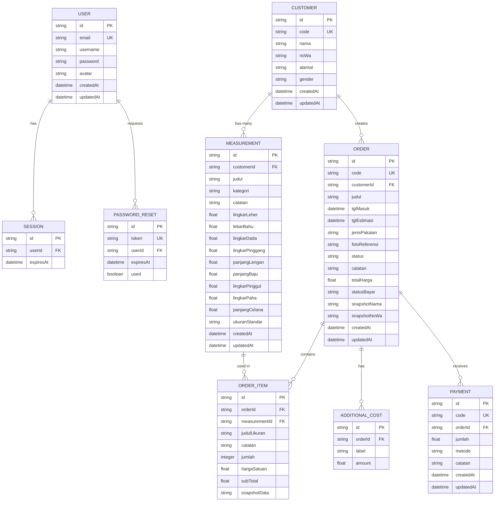
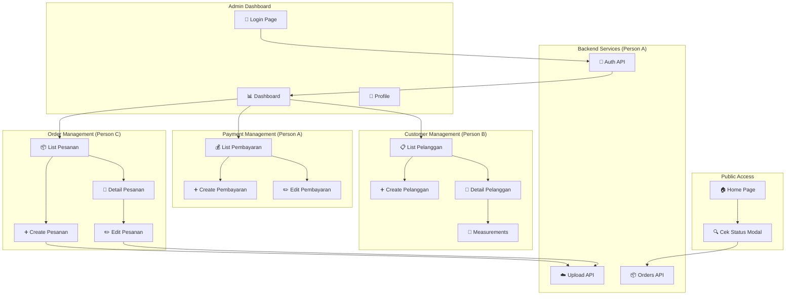
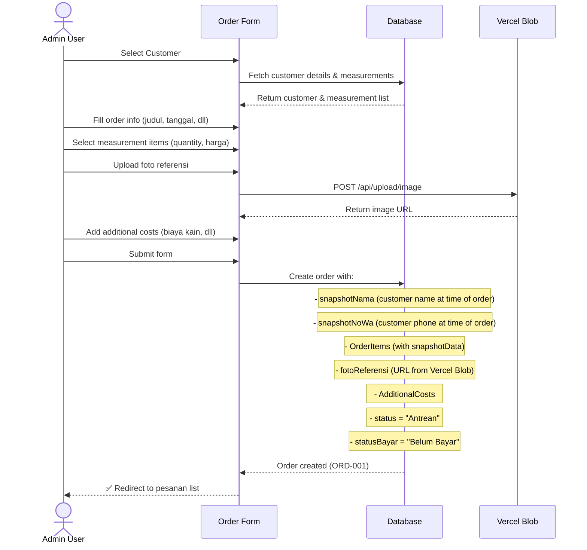
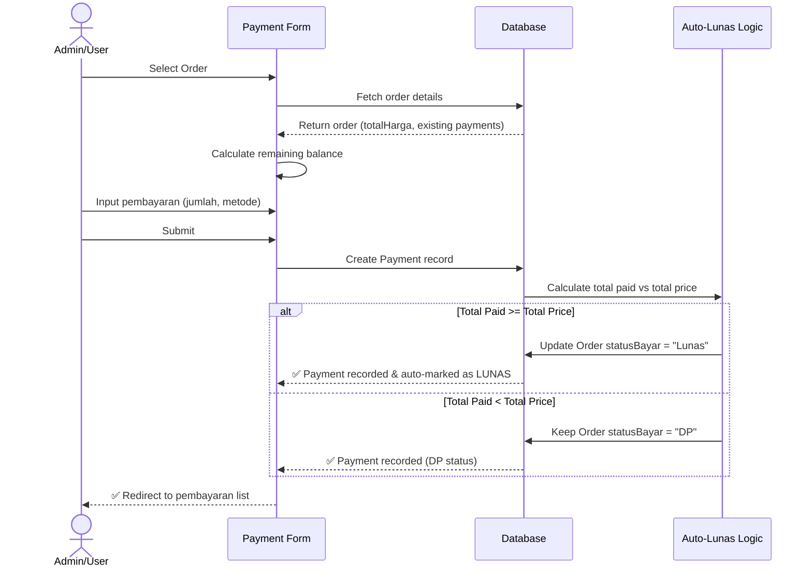
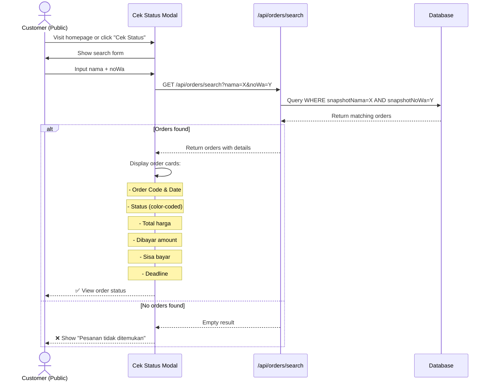
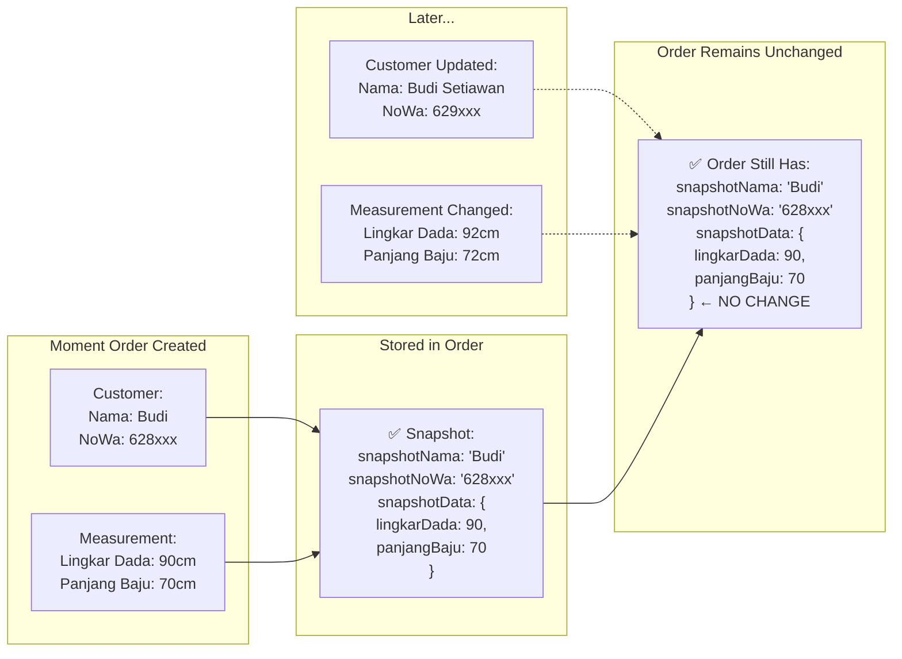

# 📊 Progress Report — AIS Sijah
**Status**: MVP 95% Completed | **Last Updated**: 2026-05-20

---

## 📋 Ringkasan Fitur & Pembagian Pekerjaan

| Fitur | Status | Pengerjaan | Progress |
|-------|--------|-----------|----------|
| **Authentication & User Management** | ✅ Done | Person A | 100% |
| **Manajemen Pelanggan (Customer)** | ✅ Done | Person B | 100% |
| **Manajemen Ukuran Badan** | ✅ Done | Person B | 100% |
| **Manajemen Pesanan (Order)** | ✅ Done | Person C | 100% |
| **Tracking Status Produksi** | ✅ Done | Person C | 100% |
| **Manajemen Pembayaran (Payment)** | ✅ Done | Person A | 100% |
| **Cek Status Publik** | ✅ Done | Person C | 100% |
| **Upload Gambar ke Cloud** | ✅ Done | Person A | 100% |
| **Dashboard (Optional)** | ⏳ In Progress | — | 0% |

---

## 👤 Person A — Authentication, Payment & Cloud Storage
**Fokus**: Backend security, payment logic, file handling

### ✅ Selesai
- [x] Login/Logout system dengan session
- [x] Password hashing menggunakan bcryptjs
- [x] Forgot Password & Reset Password flow
- [x] Session management (expires after 30 days)
- [x] Password reset token validation
- [x] Update Password functionality
- [x] **Payment recording** dengan auto-lunas logic
  - DP (Down Payment) tracking
  - Payment history per order
  - Auto status → Lunas when paid >= total
- [x] **Vercel Blob Storage integration**
  - Upload image endpoint (`/api/upload/image`)
  - Async image upload
  - Cloud storage instead of database
  - 5MB file size support

### 📁 Files yang Dikerjakan
```
src/lib/auth.ts                 — Session & user validation
src/lib/actions/auth.ts         — Login, logout, password reset
src/components/ProfileForm.tsx  — User profile management
src/components/ResetPasswordForm.tsx
src/app/api/auth/               — Auth endpoints
src/components/PembayaranRowActions.tsx
src/components/PembayaranEditForm.tsx
src/app/pembayaran/             — Payment pages
src/app/api/upload/image/route.ts  — Image upload API ⭐ NEW
```

### 🔍 Dokumentasi Fitur
**Payment Auto-Lunas Logic**:
- Saat pembayaran tercatat → sistem cek total bayar
- Jika total bayar >= total harga → status_pembayaran = "Lunas"
- Payment history tersimpan per pesanan

**Image Upload (Vercel Blob)**:
- File diupload ke cloud bukan database
- Return public URL yang disimpan di DB
- Images persist di Vercel production

---

## 👤 Person B — Customer Management & Measurements
**Fokus**: Data management, customer lifecycle, body measurements

### ✅ Selesai
- [x] **CRUD Pelanggan (Customers)**
  - Create customer baru
  - List semua customers dengan pagination
  - View customer detail
  - Edit customer info (nama, WhatsApp, alamat, gender)
  - Delete customer
  - Auto-generated customer code (e.g., CUST-001)

- [x] **Multi-version Body Measurements**
  - 1 customer → many measurements
  - 3 kategori: Atasan / Bawahan / Standar
  - Atasan fields: lingkar leher, bahu, dada, pinggang, lengan, panjang baju
  - Bawahan fields: lingkar pinggang, pinggul, paha, panjang celana
  - Measurement labels untuk identifikasi (e.g., "Ukuran Formal 2025")
  - Custom notes per measurement
  - Timestamp created/updated

- [x] **Measurement History View**
  - List semua ukuran per customer
  - Edit/delete measurements
  - Display dengan kategori grouping

### 📁 Files yang Dikerjakan
```
src/app/pelanggan/              — Customer pages
src/app/pelanggan/new/          — Create customer
src/app/pelanggan/[id]/         — Customer detail & edit
src/components/PelangganForm.tsx — Customer form component
src/lib/actions/pelanggan.ts    — Customer actions
prisma/schema.prisma            — Customer & Measurement models
```

### 🔍 Dokumentasi Fitur
**Customer Data Structure**:
- `code`: Unique customer identifier (CUST-001)
- `nama`: Full name
- `noWa`: WhatsApp number (format: 628xxx)
- `alamat`: Full address
- `gender`: Laki-laki / Perempuan

**Measurement Snapshotting**:
- Saat order dibuat → measurement data di-snapshot ke order
- Perubahan measurement di kemudian hari tidak mempengaruhi order lama
- Preserves historical accuracy

---

## 👤 Person C — Order & Status Tracking
**Fokus**: Order lifecycle, production workflow, public features

### ✅ Selesai
- [x] **CRUD Pesanan (Orders)**
  - Create order baru dengan multi-items
  - List orders dengan filter & sort
  - View order detail dengan full breakdown
  - Edit order information
  - Delete order
  - Auto-generated order code (e.g., ORD-001)

- [x] **Order Status Workflow**
  - 6 status: Antrean → Potong Kain → Dijahit → Fitting → Selesai → Diambil
  - Plus: Dibatalkan (optional)
  - Real-time status update di detail page
  - Status-based filtering in order list

- [x] **Order Items Management**
  - Multi-item per order (1 order = many items dari measurements)
  - Per-item: quantity × unit price = sub-total
  - Snapshot measurement data (terbuat dari body measurements)
  - Item-level notes

- [x] **Additional Costs**
  - Per-order biaya tambahan (kain, aksesoris, expedite, dll)
  - Dynamic cost labels
  - Add/remove costs on the fly

- [x] **Public Status Check (Cek Status)**
  - Customers cek status di halaman home tanpa login
  - Query by nama + nomor WhatsApp (snapshot fields)
  - Display: order code, status produksi, status pembayaran
  - Show: total harga, sudah dibayar, sisa bayar
  - Deadline visibility

- [x] **Image Reference Upload**
  - Upload foto referensi pakaian per order
  - Integrasi dengan Vercel Blob Storage (via Person A)
  - Display di order detail page

### 📁 Files yang Dikerjakan
```
src/app/pesanan/                — Order pages
src/app/pesanan/new/            — Create order
src/app/pesanan/[code]/         — Order detail & edit
src/app/cek-status/             — Public status check page
src/components/PesananForm.tsx  — Create order form
src/components/PesananEditForm.tsx — Edit order form
src/components/CekStatusModal.tsx  — Public status modal
src/components/StatusDropdown.tsx  — Status selector
src/lib/actions/pesanan.ts      — Order actions
src/app/api/orders/search       — Search API untuk cek status
```

### 🔍 Dokumentasi Fitur
**Order Snapshotting**:
```
Saat pesanan dibuat:
- Salin nama & noWa dari customer → snapshotNama, snapshotNoWa
- Salin seluruh measurement data → snapshotData (JSON)
- Perubahan customer data kemudian tidak mempengaruhi pesanan lama
```

**Status Workflow**:
```
Antrean (customer baru masuk)
  ↓
Potong Kain (cutting phase)
  ↓
Dijahit (sewing phase)
  ↓
Fitting (try-on & adjustment)
  ↓
Selesai (production done)
  ↓
Diambil (picked up by customer)
```

**Cek Status Feature**:
- Pelanggan input: Nama + No. WhatsApp (dari saat order)
- API query ke `snapshotNama` & `snapshotNoWa`
- Display order(s) ditemukan dengan detail lengkap
- Real-time payment status update

---

## 🎯 MVP Features — Status Summary

| # | Fitur | Done | Person | Evidence |
|---|-------|------|--------|----------|
| 1 | Auth (login/logout/password reset) | ✅ | A | `/login`, `/api/auth/*` |
| 2 | CRUD Pelanggan | ✅ | B | `/pelanggan` pages |
| 3 | CRUD Ukuran Badan (multi per pelanggan) | ✅ | B | Measurement model, detail pages |
| 4 | CRUD Pesanan + snapshot | ✅ | C | `/pesanan` pages, snapshot fields |
| 5 | Status tracking produksi | ✅ | C | StatusDropdown, status enum |
| 6 | Pencatatan pembayaran + auto-lunas | ✅ | A | `/pembayaran` pages, payment logic |
| 7 | Cek status publik (nama + noWa) | ✅ | C | `/cek-status`, `/api/orders/search` |
| 8 | Upload foto referensi (cloud) | ✅ | A | Vercel Blob integration |

---

## 🗄️ Database Architecture (ERD)



---

## 🔄 System Flow Architecture



---

## 📝 Order Creation Flow (Person C)



---

## 💰 Payment Flow (Person A)



---

## 🎯 Status Tracking Flow (Person C)

```mermaid
stateDiagram-v2
    [*] --> Antrean: Order created
    Antrean --> "Potong Kain": Admin update
    "Potong Kain" --> Dijahit: Admin update
    Dijahit --> Fitting: Admin update
    Fitting --> Selesai: Admin update
    Selesai --> Diambil: Customer pickup
    Diambil --> [*]: Order completed
    
    Antrean -.-> Dibatalkan: Cancel
    "Potong Kain" -.-> Dibatalkan: Cancel
    Dibatalkan --> [*]: Order cancelled
```

---

## 🔍 Public Status Check Flow (Person C)



---

## 📊 Data Snapshotting Illustration



---

## 📈 Metrics

- **Total Pages**: 15 (auth, pelanggan, pesanan, pembayaran, profile, dll)
- **Total API Routes**: 4 groups (auth, customers, orders, upload)
- **Database Models**: 7 (User, Session, Customer, Measurement, Order, OrderItem, Payment)
- **Components**: 20+ reusable components
- **Authentication**: ✅ Secure session-based
- **Data Persistence**: ✅ PostgreSQL (Prisma ORM)
- **File Storage**: ✅ Vercel Blob (cloud)

---

## 🚀 Deploy Checklist

- [x] Database migrations ready
- [x] Environment variables configured
- [x] Prisma schema validated
- [x] Authentication working
- [x] Image upload to cloud (no local filesystem)
- [ ] Dashboard analytics (optional, not in MVP)
- [ ] Invoice PDF export (optional, not in MVP)

---

## 📝 Catatan Teknis

### Data Flow
```
1. Customer Input → Database
2. Measurement saved per customer
3. Order created → snapshot customer & measurement data
4. Payment recorded → auto-check lunas status
5. Status updated → reflected on public cek-status
```

### Security
- Password hashed dengan bcryptjs
- Session-based auth (30 hari)
- requireUser() middleware on protected routes
- File upload validated (type & size)

### Performance
- Prisma ORM dengan indexes
- Revalidate cache on data changes
- Efficient queries (include relationships)

---

**Prepared by**: Development Team A, B, C  
**Last Updated**: 2026-05-20  
**Next Review**: Post-deployment feedback
